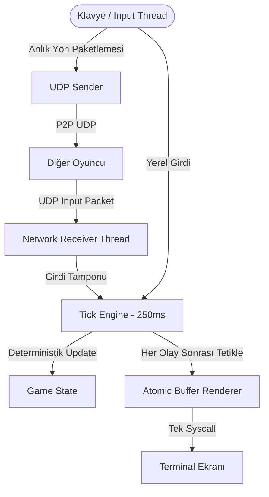

# 🐍 MSNAKE — Multiplayer P2P Snake Game

**MSNAKE**, C++20 ile sıfırdan geliştirilmiş; **Hearts of Iron IV (HOI4) tarzı Deterministik Lockstep (Tick-based)** simülasyon motoruna sahip, **P2P UDP** tabanlı ve **titreşimsiz (flicker-free)** terminal çok oyunculu yılan oyunudur.

---

## 🌟 Öne Çıkan Özellikler

- **🎯 Deterministik Lockstep Motoru (HOI4 Mantığı):** Oyun 0.25 saniyede bir (4 TPS) sabit zamanlı döngüyle ilerler. Her iki bilgisayarda da elma konumları ve çarpışmalar aynı rastgelelik tohumu (`seed`) ile birebir eşzamanlı hesaplanır.
- **⚡ Titreşimsiz (Flicker-Free) Çizim:** ANSI Cursor Repositioning (`\033[H`) ve tek bir atomik `write()` syscall'u ile ekran yırtılması veya yanıp sönme olmadan akıcı render.
- **🌐 8 Karakterlik Akıllı Oda Kodları:** IP ve Port bilgisi 6 bayta sıkıştırılıp *Among Us* tarzı `XXXX-YYYY` kodlarına dönüştürülür (sıfır merkezi sunucu maliyeti).
- **📡 P2P UDP Ağ Protokolü:** Düşük gecikmeli, binary paket serileştirmeli (`#pragma pack(1)`) saf eşler arası (Peer-to-Peer) haberleşme.
- **🌍 STUN (RFC 5389) & UPnP Desteği:** Google STUN sunucuları üzerinden genel (Public) IP tespiti ve otomatik modem yönlendirme altyapısı.
- **🧪 Kapsamlı Test Paketi:** Oda kodları, UDP soketleri, non-blocking I/O ve STUN protokolü için birim testler.

---

## 🏛️ Mimari ve Çalışma Mantığı



### 1. 48-Bit Oda Kodu Sıkıştırma (Room Code)
Bir oyuncunun diğerine bağlanması için gereken tüm bilgi:
- **4 Bayt:** IPv4 Adresi (örn: `78.185.121.204`)
- **2 Bayt:** Port Numarası (örn: `8080`)

Bu 6 bayt (48 bit), URL-safe Base64 tablosu ile tam **8 karakterlik** bir koda dönüştürülür:
```text
78.185.121.204:8080  --->  wKgB-Ih-Q
```

---

## 🌐 Farklı Şehirlerden Oynamak (Port Yönlendirme Rehberi)

Farklı internet ağlarındaki iki arkadaşın birbirine doğrudan bağlanabilmesi için odayı kuracak olan kişinin (Host) modeminde **Port Yönlendirme (Port Forwarding)** ayarı yapması gerekir.

### Modem Ayar Tablosu (Örnek):

1. Tarayıcıdan modem arayüzüne girin (`http://192.168.1.1`).
2. **Port Yönlendirme / Port Forwarding** menüsüne gidin ve yeni bir kural ekleyin:

| Alan Adı | Girilecek Değer | Açıklama |
| :--- | :--- | :--- |
| **Hizmet Adı** | `msnake` | Kural için açıklayıcı isim |
| **WAN Arayüzü** | `Internet_DSL` / `Internet_ETH` | Aktif internet hattınız |
| **Sunucu IP Adresi** | `192.168.1.37` *(Mac'inizin Yerel IP'si)* | `ifconfig` ile bulunan yerel IP |
| **Başlangıç Portu** | `8080` | Dış dünyadan gelen port |
| **Bitiş Portu** | `8080` | Dış port bitişi |
| **Çeviri Başlangıç Portu** | `8080` | Bilgisayarınızdaki dinlenen port |
| **Çeviri Bitiş Portu** | `8080` | Hedef port bitişi |
| **Protokol** | `UDP` veya `TCP/UDP` | UDP seçilmelidir |

> 💡 **Nasıl Oynanır?**
> 1. Host oyunu açar -> `[1] Oda Kur` -> `[2] Internet` seçer.
> 2. Ekranda çıkan **Oda Kodunu** arkadaşına gönderir.
> 3. Arkadaşı oyunu açar -> `[2] Odaya Katıl` seçip kodu girer.
> 4. Bağlantı anında kurulur ve oyun başlar!

---

## 🎮 Kontroller

| Tuş | Eylem |
| :--- | :--- |
| **W / Yukarı Ok** | Yukarı Dön |
| **S / Aşağı Ok** | Aşağı Dön |
| **A / Sol Ok** | Sola Dön |
| **D / Sağ Ok** | Sağa Dön |
| **Q** | Oyundan Çık |

---

## 🛠️ Derleme ve Çalıştırma

### Gereksinimler
- Clang++ veya GCC (C++20 desteği ile)
- Make
- macOS veya Linux

### Derleme Komutları
```bash
# Projeyi derle
make

# Birim testlerini çalıştır
make test

# Oyunu başlat
make run
# veya
./bin/out
```

---

## 📁 Proje Dosya Yapısı

```text
msnake/
├── include/
│   ├── game/
│   │   ├── canvas.hpp       # Titreşimsiz ANSI terminal çizim matrisi
│   │   ├── game.hpp         # Multi-threaded oyun motoru & lobi
│   │   └── snake.hpp        # Vektör tabanlı yılan veri yapısı & hareket
│   ├── network/
│   │   ├── connection.hpp   # POSIX UDP socket sarmalayıcısı
│   │   ├── packet.hpp       # Binary ağ paketleri protokolü
│   │   ├── room_code.hpp    # 48-bit Base64 oda kodu encoder/decoder
│   │   ├── stun.hpp         # Google STUN (RFC 5389) istemcisi
│   │   └── upnp.hpp         # SSDP & SOAP port yönlendirme
│   └── utils/
│       ├── thread_safe_queue.hpp # Generic thread-safe event kuyruğu
│       └── utils.hpp        # Point / Vec2 matematik struct'ı
├── lib/                     # CPP kaynak dosyaları
├── tests/                   # Otomatik birim testleri
├── makefile                 # Modüler derleme kuralları
└── README.md                # Dokümantasyon
```

---

## 📄 Lisans
MIT License. Dilediğiniz gibi geliştirebilir, fork'layabilir ve arkadaşlarınızla oynayabilirsiniz!
